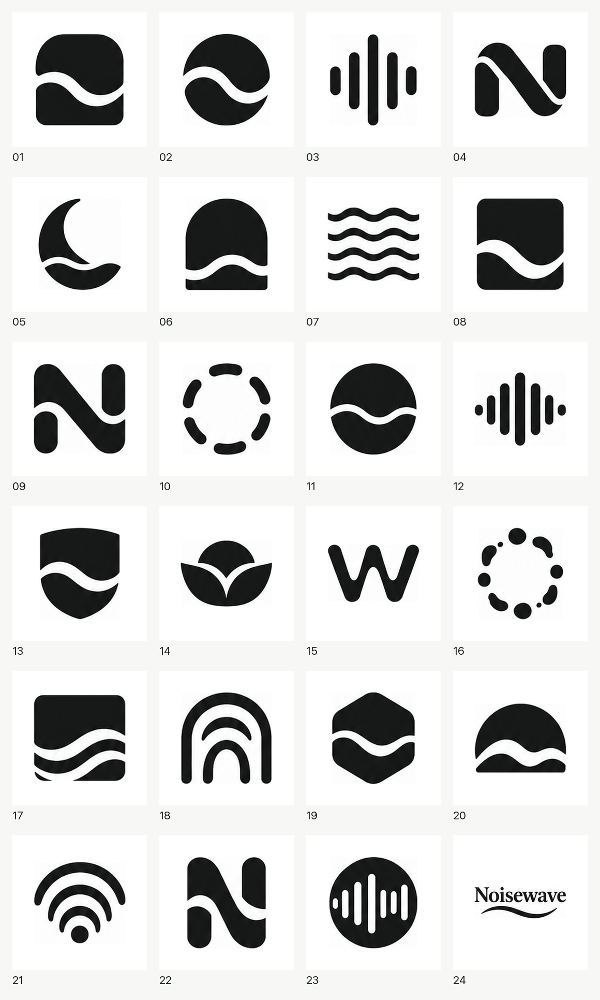
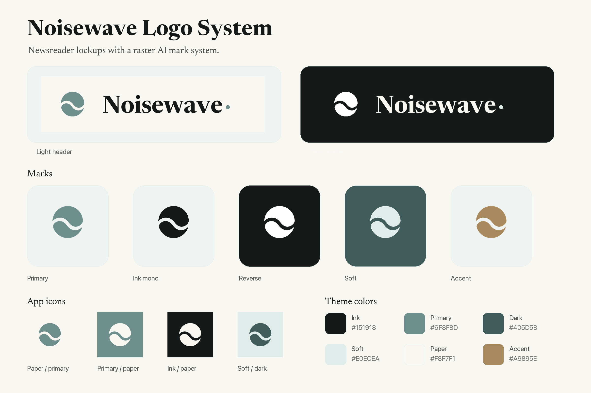

# Brand Icon System

[English](README.md) | [简体中文](README.zh-CN.md)

A staged Agent Skills repository for generating production-ready PNG brand icon systems.

The workflow is intentionally interactive: brief, explore, select, refine, produce, and audit. It is meant for AI agents that can generate PNG images and run local Python scripts.





## What It Does

- Generates a 4x6 black-and-white logo exploration board.
- Splits the board into 24 numbered PNG candidates.
- Pauses for user selection before final production.
- Refines the selected direction into a clean raster mark.
- Exports transparent marks, app icons, favicons, lockups, theme-color variants, previews, manifest, and README.
- Audits the output for mask quality, favicon readability, transparent backgrounds, and lockup composition.

## Repository Layout

```text
brand-icon-system/
  skills/
    brand-icon-system/       # Orchestrator skill and shared scripts/assets
    brand-logo-brief/        # Theme to logo brief
    brand-logo-explore/      # Candidate board and selection sheet
    brand-logo-refine/       # Selected candidate to final mark
    brand-logo-produce/      # PNG asset system export
    brand-logo-audit/        # Final quality review
  docs/
  examples/
  tests/
```

## Requirements

- Python 3.10+
- Pillow
- An AI image generation tool that can create PNG outputs

Install Python dependencies:

```bash
python3 -m pip install -r requirements.txt
```

## Installation

This repository follows the Agent Skills layout: each skill lives in `skills/<skill-name>/SKILL.md`.

If your agent host supports installing skills from GitHub, install all skills from this repository. For hosts that support `gh skill`, the intended command shape is:

```bash
gh skill install OWNER/brand-icon-system --all
```

Manual install works everywhere:

```bash
mkdir -p ~/.agents/skills
cp -R skills/* ~/.agents/skills/
```

Use the directory expected by your host. Examples include `.agents/skills`, `.claude/skills`, or `~/.codex/skills`.

Or use the bundled installer and pass the skill root your host expects:

```bash
./scripts/install.sh ~/.agents/skills
```

## Usage

Start with the orchestrator:

```text
Use $brand-icon-system to generate a brand icon system for "AI white noise".
```

The default flow stops after exploration and asks the user to pick candidate numbers. It only proceeds to final PNG production after a candidate or refined mark is approved.

For lower-level control, invoke a stage directly:

```text
Use $brand-logo-explore to generate a black-and-white candidate board for "AI white noise".
Use $brand-logo-produce to export this approved mark as a PNG logo system.
```

## Validation

Run:

```bash
python3 tests/validate_skills.py
python3 tests/smoke_test_split_board.py
python3 tests/smoke_test_build_system.py
```

## Prior Art

The exploration stage is inspired by the black-and-white candidate workflow in `fucha1122/minimalist-bw-logo-skill`: generate broad monochrome directions first, then produce from one selected mark. This project uses its own staged prompts, scripts, and PNG production pipeline.

## License

Code and documentation are MIT licensed. The bundled Newsreader font is licensed under the SIL Open Font License; see `skills/brand-icon-system/assets/fonts/OFL.txt`.
